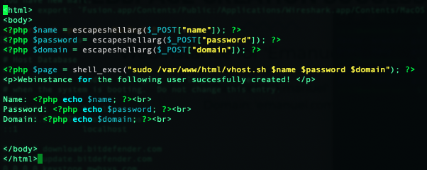
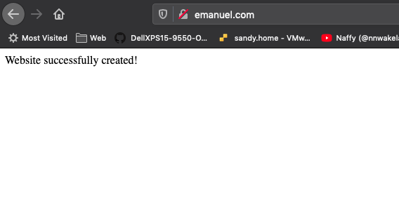
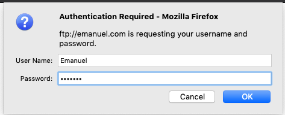

<h4>
      Proof of Concept:
    </h4>
    
Please keep in mind the following is just an <b>example</b> and demonstration of how the script I've written could be used. With no regard to error handling and input validation.
 
    
First an end-user navigates to your index.html.

    
    
When navigating to the hosting page a customer is greeted with the following:

    
    
The end-user fills in their details along with the domain to be registered.

    
    
Upon pressing the Register button, the data filled into the form is handled by a PHP script.

    
    
On the front end, the customer is shown a confirmation page.

    
    
The virtual host has now been created successfully along with the user account.

    
    
If an FTP service is installed and configured the end-user can also access its files through FTP.

    
    

